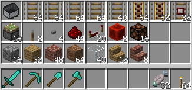

# Rotation Hotbar
これは Spigot 上で動作するプラグインです。

スニーク (Default:[Shift]) しながら、持っているアイテムの切り替え (Default:[F]) をすることで、
インベントリの全アイテムを 1 段下にローテーションすることができます。
これにより、インベントリを開くことなく、全ての所持アイテムにアクセスすることができます。

動作確認済み Minecraft バージョン: **1.12.2, 1.14.4**

恐らく対応しているバージョン: **1.9+**

